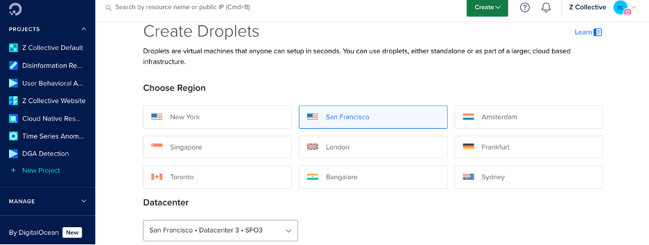
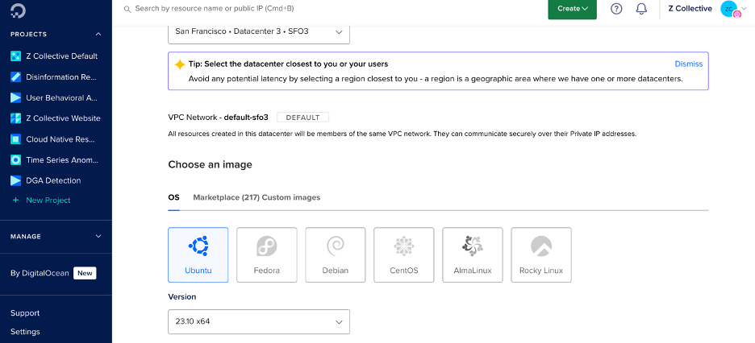
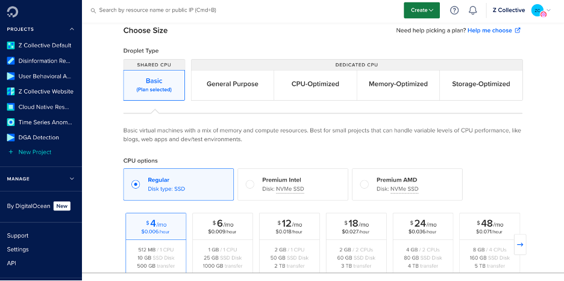
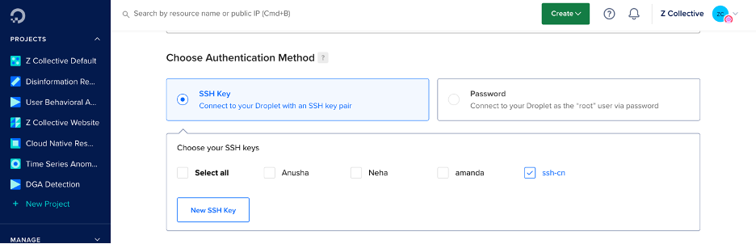
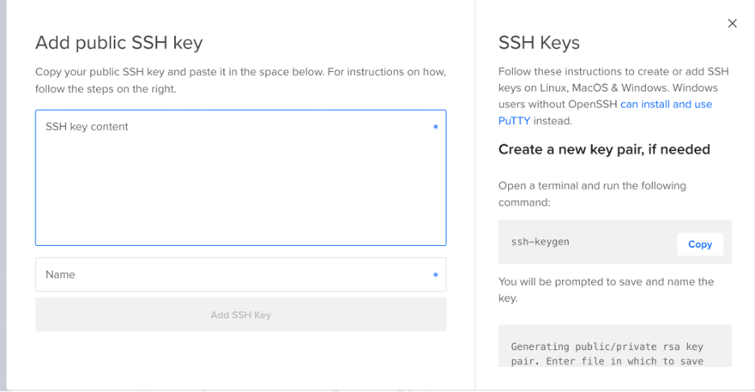
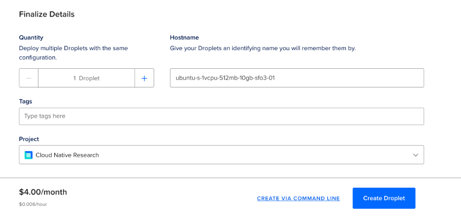

# Create a Droplet (VM) on DigitalOcean

**Step 1:** 

Sign in to your DigitalOcean account (https://cloud.digitalocean.com)

**Step 2:** 

Navigate to your project and click on **Create** and then Select **Droplet** from the drop down menu


**Step 3:**

Choose a Region  and select a Datacenter



**Step 4:** 

Choose an image



**Step 5:** 

Choose a size according to your project requirements. In this case, just select “Regular” and the smallest droplet size available. You can always resize the droplet later!



**Step 6:** 

Add an existing SSH key. If there is none, create a new SSH key and add as shown in step 7.



**Step 7:** 

Add an SSH key if you don't already have one in the DigitalOcean account. You can do this by copying the contents of the public key you created (which should be saved in `C:\Users\<yourusername>\.ssh\<whatever_you_called_your_key.pub>) (Note that you want to use the public key ending in `.pub`)

You can output the contents of the key using: 

```bash
type whatever_you_called_your_key.pub
```

Copy and paste that text into the box that says “SSH key content”:



**Step 9:** 

Review all the chosen settings, add an identifable name for your droplet, and click on “Create Droplet”. A new droplet has been successfully created.

